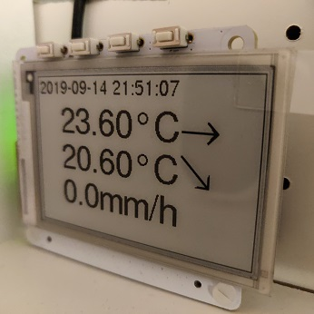
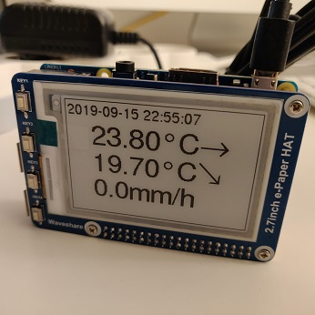
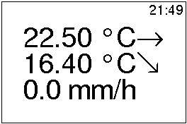
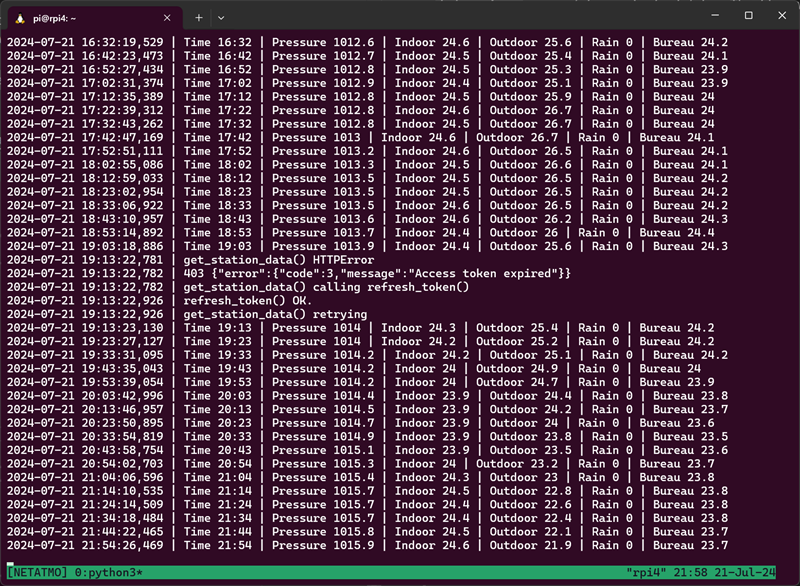

# netatmo

NetAtmo weather station display, based on a Raspberry Pi and an e-Paper screen.

Table of contents
=================

* [Introduction](#introduction)
* [Installation](#installation)
  * [Raspbian for the Raspberry Pi](#raspbian)
  * [PaPiRus setup](#papirus)
  * [Waveshare Setup](#waveshare)
  * [Download the app!](#download)
  * [NetAtmo API](#netatmo)
* [Files](#files)
* [Running the program](#running)
* [Launching on system startup](#startup)
* [References](#references)

<a name="introduction"></a>
Introduction
============

The [NetAtmo Smart Weather Station][1] is a nice weather station with an indoor and an outdoor module, and optional rain gauge, anemometer and additional indoor modules. All the data from the different modules is available on the [web portal][2] and on the mobile app.

[1]: https://www.netatmo.com/en-eu/weather/weatherstation

[2]: https://my.netatmo.com/app/station

The modules themselves don't have any kind of display, so this project is an attempt to make a compact dedicated display for the NetAtmo weather station with at least indoor and outdoor temperatures, using a Raspberry Pi and a e-Paper screen.

The first setup I tried is this one:

- [Raspberry Pi Zero W][3]. The Zero W can be found with a soldered header if soldering is not your thing: it is called a [Raspberry Pi Zero WH][4]. See [here][5] or [here][6].

- [PaPiRus ePaper / eInk Screen HAT for Raspberry Pi][7]. I use the 2.7 inch screen, which has a resolution of 264 x 176.

[3]: https://www.raspberrypi.org/products/raspberry-pi-zero-w/

[4]: https://www.raspberrypi.org/blog/zero-wh/

[5]: https://uk.pi-supply.com/products/raspberry-pi-zero-w-soldered-header

[6]: https://shop.pimoroni.com/products/raspberry-pi-zero-wh-with-pre-soldered-header

[7]: https://uk.pi-supply.com/products/papirus-epaper-eink-screen-hat-for-raspberry-pi



Then I tried a second setup:

- [Raspberry Pi 3 B+][8] or [Raspberry Pi 4][9].

- [Waveshare 2.7inch e-Paper HAT][10], which has the same size and resolution of 264 x 176 as the PaPiRus.

[8]: https://www.raspberrypi.org/products/raspberry-pi-3-model-b-plus/

[9]: https://www.raspberrypi.org/products/raspberry-pi-4-model-b/

[10]: http://www.waveshare.com/2.7inch-e-paper-hat.htm



The first setup works fine but the PaPiRus screen is not attached to the HAT board, making the thing very fragile without a suitable case. The Waveshare is well attached and the whole setup is much more robust. But on the software side, the PaPiRus has a much better story than the Waveshare. Anyway, both work as expected.

As this is a new project (as of sept. 2019), I chose Python 3 for the code: Python 3.5.3 on Raspbian Stretch, 3.7.3 on Raspbian Buster.

<a name="installation"></a>
Installation
============

<a name="raspbian"></a>
Raspbian for the Raspberry Pi
-----------------------------

Download the [Raspbian 9 (stretch) lite (without GUI) image][11], or the latest [Raspian 10 (buster) lite][12]. Both work, but I advise to use a _lite_ version, without a GUI.

Copy the image on the microSD card, for instance with [etcher][13].

[11]:http://downloads.raspberrypi.org/raspbian_lite/images/raspbian_lite-2018-04-19/2018-04-18-raspbian-stretch-lite.zip

[12]: https://www.raspberrypi.org/downloads/raspbian/

[13]: https://www.balena.io/etcher/

Before removing the microSD card from your computer, in the `boot` volume of the card, create an empty file named `ssh`. This is the simplest way to enable the OpenSSH server on Raspbian.

Also copy a `wpa_supplicant.conf` file to the same `boot` volume, with this content (edit your country, Wifi name and password):

```
ctrl_interface=DIR=/var/run/wpa_supplicant GROUP=netdev
update_config=1
country=FR

network={
	ssid="Your Wifi network name"
	psk="Your Wifi network password"
}
```

Remove the microSD from the PC, insert it in the Raspberry Pi and plug the power supply. The first boot should take a few minutes. It should connect to your Wifi network and you should be able to get its IP address from your router.

Connect to the device from you PC or Mac:

```
ssh pi@<IP_address>
```

The user is `pi` and the password is `raspberry`.

If this doesn't work, boot the Raspberry with its microSD, a keyboard and an HDMI screen, login with the `pi` user and use the `raspi-config` utility to configure the network.

Once connected with SSH, install the latest OS updates, and reboot:

```
sudo apt update
sudo apt dist-upgrade
sudo reboot
```

Python 3 should already be installed. You can check its version with:

```
python3 -V
```

Install [git][14], the [Freefont TrueType fonts][15], [pip][16], [PIL][17], and the [Requests][18] module (needed to call the NetAtmo API):

```
sudo apt install git fonts-freefont-ttf python3-pip python3-pil python3-requests
```

[14]: https://git-scm.com/

[15]: http://savannah.gnu.org/projects/freefont/

[16]: https://pip.pypa.io/en/stable/

[17]: https://python-pillow.org/

[18]: https://github.com/psf/requests

<a name="papirus"></a>
PaPiRus setup
-------------

Follow these instructions if you have a PaPiRus HAT and e-Paper screen.

First, the hardware setup. Follow this documentation:

https://www.pi-supply.com/make/papirus-assembly-tips-and-gotchas/

Next, the Python module:

IMPORTANT: On the Raspberry Pi, you need to __enable both SPI and I2C interfaces__ :

```
sudo raspi-config
```

Select `Interfacing options` > `SPI` > `Yes`. Without exiting the tool, still in `Interfacing options`, select `I2C` > `Yes`.

Reboot:

```
sudo reboot
```

Then, follow the instructions here: https://github.com/PiSupply/PaPiRus. Or, here is the short version of these instructions:

```
sudo apt-get install git bc i2c-tools fonts-freefont-ttf whiptail make gcc -y
sudo apt-get install python3-pil python3-smbus python3-dateutil -y
git clone --depth=1 https://github.com/PiSupply/PaPiRus.git
cd PaPiRus
sudo python3 setup.py install
sudo papirus-setup
sudo papirus-set 2.7
```

The last command sets the size of the screen you have.

You can then test the Python API with tools present in /usr/local/bin. For instance:

```
papirus-write "Hello world!"
papirus-clear
```

<a name="waveshare"></a>
Waveshare Setup
---------------

If you have a Waveshare 2.7inch e-Paper screen, the instructions are here:

https://www.waveshare.com/wiki/2.7inch_e-Paper_HAT

and the software is here :

https://github.com/waveshare/e-Paper

The hardware setup is very simple. Just plug the board on the 40-pin GPIO header. The software setup is documented on the wiki above, and here is the short and simplified version:

Activate the SPI interface:

```
sudo raspi-config
```

Choose `Interfacing Options` > `SPI` > `Yes` to enable SPI interface.

Reboot:

```
sudo reboot
```

Reconnect and install Python 3 libraries:

```
sudo apt-get update
sudo apt-get install python3-pip python3-pil python3-numpy
sudo pip3 install RPi.GPIO
sudo pip3 install spidev
```

Download the Waveshare repo in your home dir:

```
cd
git clone https://github.com/waveshare/e-Paper
```

(Optional) test the display:

```
cd e-Paper/RaspberryPi\&JetsonNano/python/examples
python3 epd_2in7_test.py
cd
```

This should display some test patterns on the Waveshare screen.

<a name="download"></a>
Download the app!
-----------------

Download the code in your home dir:

```
cd
git clone https://github.com/psauliere/netatmo.git
cd netatmo
```

To test the display module, type this:

```
cp sample_data.json data.json
./display.py
```

This should display a sample based on the sample data included in the repo.

<a name="netatmo"></a>
NetAtmo API
-----------

First you need to get the MAC address of your indoor module. Open https://my.netatmo.com/app/station, authenticate with your NetAtmo username and password, then click on _Manage my Station_. In the popup, look for _Indoor module_ and then _MAC address_. Take note of the value, which begins with `70:ee:50:`.

Then go to https://dev.netatmo.com/myaccount/, authenticate with your NetAtmo username and password, and create a new app. Take note of the _client id_ and the _client secret_ for your app.

Once you have all these values, copy the `sample_config.json` file to a new `config.json` file. Edit the file with your values:

- `username`: your NetAtmo username
- `password`: your NetAtmo password
- `client_id`: your NetAtmo app client id
- `client_secret`: your NetAtmo app client secret
- `device_id`: your indoor module MAC address

<a name="files"></a>
Files 
=====

You need these 3 files to begin:

- `config.json`
- `netatmo.py`
- `display.py`

If `config.json` does not exist, `netatmo.py` creates an empty one and you have to edit it.

`config.json` is the configuration file. You must edit this file with your values (see above: NetAtmo API).

`netatmo.py`: main module. Every 10 minutes, it calls the [NetAtmo getstationdata API][getstationdata] to get the weather station data, stores it to the `data.json` file, and calls `display.py`. Manages the authentication and refreshes the oAuth2 token according to the NetAtmo documentation.

[getstationdata]: https://dev.netatmo.com/resources/technical/reference/weather/getstationsdata

`display.py`: display module, called by `netatmo.py` every 10 minutes. It reads `data.json` and displays the data on the screen. So if you choose another screen, or wish to change the display, you just have to adapt or rewrite this file. If no supported screen is present, `display.py` draws the image of the display into a `image.bmp` file. See below (`image.bmp`) for an example of display.

Files created by the program:

`token.json`: authentication token and refresh token. This file is written by `netatmo.py` every time it authenticates or refreshes the authentication token.

`data.json`: weather station data file. This file holds the JSON result of the latest NetAtmo `getstationdata` API call.

`image.bmp`: image of the latest PaPiRus screen display, written by `display.py` Example:



In this example, the display shows:

- the time of the `getstationdata` API call.
- the indoor temperature and trend
- the outdoor temperature and trend
- the rain in mm/h

<a name="running"></a>
Running the program 
===================

Run `./netatmo.py`, for instance in a `tmux` session to let it run even when you disconnect your SSH session.

On the console, you will see that:

 - Every 10 minutes, netatmo.py gets weather data and prints 1 line on the console with the date, time, temperatures and, if you have the modules, rain and wind data.
 - Every three hours, the access token expires and the program refreshes it.

To stop the program, type Ctrl+C.



<a name="startup"></a>
Launching on system startup
===========================

To act like an appliance, the program must survive power failures, that is it must automatically launch on system boot. As I find it convenient to use tmux to be able to watch the program's console output anytime I ssh to the system, the `launcher.sh` script creates a tmux session named NETATMO and launches `netatmo.py` inside the new tmux session.

First you need to install `tmux` if not already done:
```
sudo apt install tmux
```

To run the `launcher.sh` script at system startup, edit the `/etc/rc.local` file as root and add this line, **before** the `exit 0` line:

```
su -c /home/pi/netatmo/launcher.sh -l pi
```

This will run the script as the `pi` user.

Later, when you ssh to the system as the `pi` user, you can attach to the NETATMO session this way:

```
tmux a
```

and detach from the session with this key sequence: `Ctrl+B`, `d`.

<a name="references"></a>
References
==========

- [NetAtmo developer documentation](https://dev.netatmo.com/resources/technical/introduction)
- [PaPiRus documentation](https://github.com/PiSupply/PaPiRus)
- [Waveshare 2.7inch e-Paper documentation](https://www.waveshare.com/wiki/2.7inch_e-Paper_HAT)
- [Another NetAtmo Display project: netatmo-display](https://github.com/bkoopman/netatmo-display)

More on tmux:

- [A Quick and Easy Guide to tmux](https://www.hamvocke.com/blog/a-quick-and-easy-guide-to-tmux/)
- [The Tao of tmux](https://leanpub.com/the-tao-of-tmux/read)
