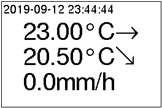

# netatmo
NetAtmo weather station display

> Warning: Code and documentation are a work in progress.

The [NetAtmo Smart Weather Station][1] is a nice weather station with an indoor and an outdoor module, and optional rain gauge, anemometer and additional indoor modules. All the data from the different modules is available on the [web portal][2] and on the mobile app.

[1]: https://www.netatmo.com/en-eu/weather/weatherstation
[2]: https://my.netatmo.com/app/station

The modules themselves don't have any kind of display, so this project is an attempt to make a compact dedicated display for the NetAtmo weather station with at least indoor and outdoor temperatures, using:

- a [Raspberry Pi Zero W][3] --a Raspberry Pi 3 or 4 would also work, although less compact.
- a [PaPiRus ePaper / eInk Screen HAT for Raspberry Pi][4]. I use the 2.7 inch screen.

[3]: https://www.raspberrypi.org/products/raspberry-pi-zero-w/

[4]: https://uk.pi-supply.com/products/papirus-epaper-eink-screen-hat-for-raspberry-pi

To be clear: I chose the PaPiRus ePaper HAT for Raspberry Pi because the pHAT and screen for the Raspberry Pi Zero are two small for my taste. Anyway, you will see that the display code is isolated so that you can easyly replace it with your own if you choose another screen.

As this is a new project (as of sept. 2019), I chose Python 3 for the code: Python 3.5.3 on Raspbian Stretch, but also works on 3.6 and 3.7.

Preparation
===========

> Warning: documentation is not complete.

Raspberry Pi
------------

### Raspbian

Raspbian 9 (stretch) lite (without GUI)

http://downloads.raspberrypi.org/raspbian_lite/images/raspbian_lite-2018-04-19/2018-04-18-raspbian-stretch-lite.zip

Copy the image on the microSD card, for instance with etcher:

https://www.balena.io/etcher/

In the `boot` volume of the microSD card, create an empty file named `ssh`. This is the simplest way to enable the OpenSSH server on Raspbian.

Boot the Raspberry with its microSD, a keyboard and a HDMI screen to configure the wifi connection.

Login with this user: username = `pi`, password = `raspberry`.


```
sudo apt update
sudo apt dist-upgrade
sudo reboot

sudo autoremove
```

On the Raspberry Pi [Zero], you need to enable the SPI and the I2C interfaces. You can enable the SPI by typing `sudo raspi-config` at the command line and then selecting `Interfacing options` > `SPI` and then selecting `Enable`. Without exiting the tool still in `Interfacing options` > `I2C` and then selecting `Enable`. (from [PaPiRus documentation](https://github.com/PiSupply/PaPiRus))


Python 3
--------

```
$ python3 -V
```

Install pip for python3:
```
sudo apt install python3-pip
sudo python3 -m pip install -upgrade pip
```

Requests Python module
----------------------

Install the Requests module:

```
sudo pip3 install requests
```
or
```
sudo python3 -m pip install requests
```

PaPiRus hardware setup
----------------------

https://www.pi-supply.com/make/papirus-assembly-tips-and-gotchas/

PaPiRus Python module
---------------------

https://github.com/PiSupply/PaPiRus

NetAtmo API
-----------

First you need to get the MAC address of your indoor module. Open https://my.netatmo.com/app/station, authenticate with your NetAtmo username and password, then click on _Manage my Station_. In the popup, look for _Indoor module_ and then _MAC address_. Take note of the value, which begins with `70:ee:50:`.

Then go to https://dev.netatmo.com/myaccount/, authenticate with your NetAtmo username and password, and create a new app. Take note of the _client id_ and the _client secret_.

One you have all these values, copy the `sample_config.json` file to a new `config.json` file. Edit the file with your values:

- `username`: your NetAtmo username
- `password`: your NetAtmo password
- `client_id`: your NetAtmo app client id
- `client_secret`: your NetAtmo app client secret
- `device_id`: your indoor module MAC address


Files
=====

You need these 3 files to begin:

- `netatmo.py`
- `display.py`
- `config.json`

If `config.json` does not exist, `netatmo.py` creates an empty one and you have to edit it.

`config.json`: configuration file. You must edit this file with your values (see above: NetAtmo API).

`netatmo.py`: main module. Every 10 minutes, it calls the [NetAtmo `getstationdata` API][9] to get the weather station data, stores it to the `data.json` file, and calls `display.py`. Manages the authentication and refreshes the oAuth2 token according to the NetAtmo documentation.

[9]: https://dev.netatmo.com/resources/technical/reference/weather/getstationsdata

`display.py`: display module, called by `netatmo.py`every 10 minutes. It reads `data.json` and displays the data on the screen. So if you choose another screen, you just have to rewrite this file. If no PaPiRus screen is present, `display.py` does nothing, so you can run `netatmo.py` on any system with python3, with or without an ePaper screen. See below (`image.bmp`) for an example of display.

`token.json`: authentication token. This file is written by `netatmo.py` every time it authenticates or refreshes the authentication token.

`data.json`: weather station data file. This file holds the JSON result of the latest NetAtmo `getstationdata` API call, wich happens every 10 minutes.

`image.bmp`: image of the latest PaPiRus screen display, written by `display.py` Example:



In this example, the display shows:

- the date date & time of the `getstationdata` API call.
- the indoor temperature and trend
- the outdoor temperature and trend
- the rain in mm/h

Running the program
===================

> Warning: documentation is not complete.

Run `netatmo.py`, for instance in a `tmux` session.

https://www.hamvocke.com/blog/a-quick-and-easy-guide-to-tmux/

https://leanpub.com/the-tao-of-tmux/read

To stop the program, type Ctrl+C.


